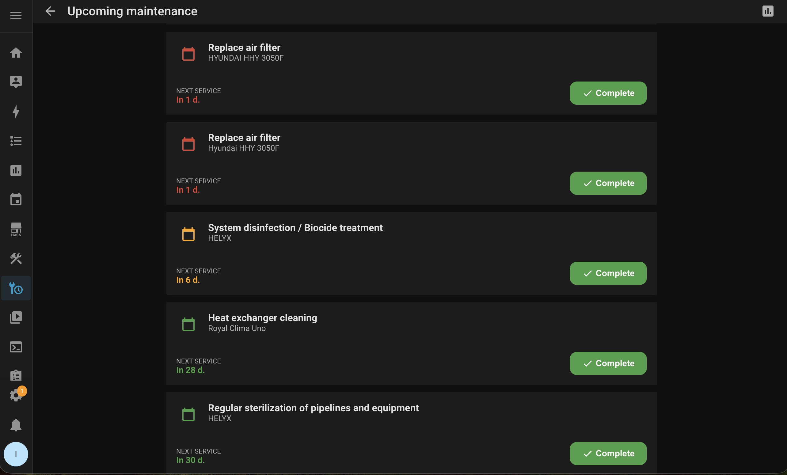
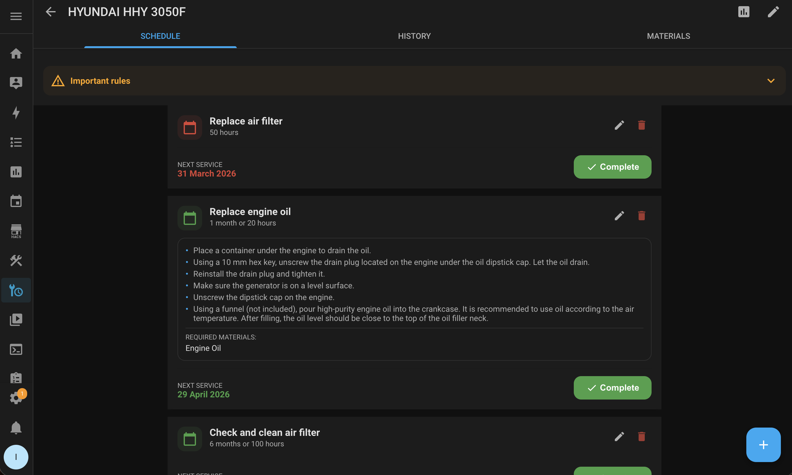
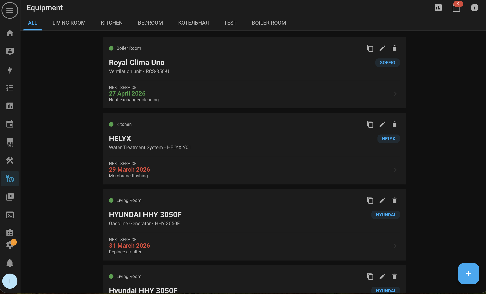

# InstruMatic Home Assistant Integration

[](https://github.com/hacs/integration)


InstruMatic is a smart assistant for home equipment maintenance. Use AI to automatically create maintenance schedules based on user manuals.

## ✨ Features

- 🤖 **AI Manual Analysis** — Upload a PDF manual and AI will extract the maintenance schedule
- 📅 **Maintenance Calendar** — Automatic reminders for scheduled maintenance
- 🏠 **Home Assistant Integration** — Equipment syncs with HA locations
- 📊 **Reports** — Track maintenance costs
- 🌐 **Multi-language** — Support for English and Russian
- 📱 **Mobile App** — Available for Android

## 📋 Requirements

- Home Assistant 2023.1.0 or newer

## 🚀 Installation

### Via HACS (Recommended)

1. Open **HACS** in Home Assistant
2. Click **Custom repositories**
3. Add repository `https://github.com/AndreiNikolaev/InstruMatic_HA` with category **Integration**
4. Find **InstruMatic** in the list and click **Install**
5. Restart Home Assistant

### Manual Installation

1. Copy the `custom_components/instrumatic` folder to `<config_dir>/custom_components/`
2. Restart Home Assistant
3. Go to **Settings** → **Devices & Services** → **Add Integration**
4. Search for **InstruMatic** and follow the instructions

## 📸 Screenshots

### Main Screen with Equipment List



### AI-Powered Equipment Setup Wizard



### Upcoming Maintenance Tasks



## ⚙️ Configuration

After installation:

1. Go to **Settings** → **Devices & Services**
2. Click **Add Integration** and select **InstruMatic**
3. Follow the instructions to create a calendar

## 🎯 Usage

### Adding Equipment

1. Open the **InstruMatic** panel from the sidebar
2. Click **+** (add equipment)
3. Choose one of the methods:
   - **Fill with AI** — Upload a PDF manual or provide a link
   - **Manually** — Enter data yourself

### AI Analysis

When you upload a manual, AI will automatically:
- Extract equipment name
- Identify device type
- Create maintenance tasks with periodicity
- Add required materials

> ⚠️ **Important:** AI can make mistakes. Always verify extracted data with the original manual.

### Viewing Upcoming Tasks

Click the 📅 icon in the top bar to view upcoming maintenance tasks.

### Reports

Click the 📊 icon to generate a maintenance report for a selected period.

## 📁 Structure

```
custom_components/instrumatic/
├── __init__.py          # Integration initialization
├── config_flow.py       # UI configuration flow
├── const.py             # Constants
├── manifest.json        # Metadata
├── strings.json         # Localization strings
├── translations/        # Translations
│   ├── en.json
│   └── ru.json
├── calendar.py          # Home Assistant calendar
├── sensor.py            # Sensors
├── utils.py             # Utilities
└── www/                 # Web panel
    ├── index.html
    ├── instrumatic-panel.js
    └── js/
        ├── app.js
        └── api.js
```

## 📱 Mobile App

InstruMatic is also available as a mobile app for Android:
- Cloud data synchronization
- Notifications for upcoming maintenance
- Material barcode scanning

## 🤝 Support

- **Issues:** [GitHub Issues](https://github.com/AndreiNikolaev/InstruMatic_HA/issues)
- **Discussions:** [GitHub Discussions](https://github.com/AndreiNikolaev/InstruMatic_HA/discussions)

## 📄 License

MIT License — see [LICENSE](LICENSE) for details.

## 🙏 Credits

- [Home Assistant](https://www.home-assistant.io/) — Great smart home platform
- [HACS](https://hacs.xyz/) — Makes custom integrations easy to install

